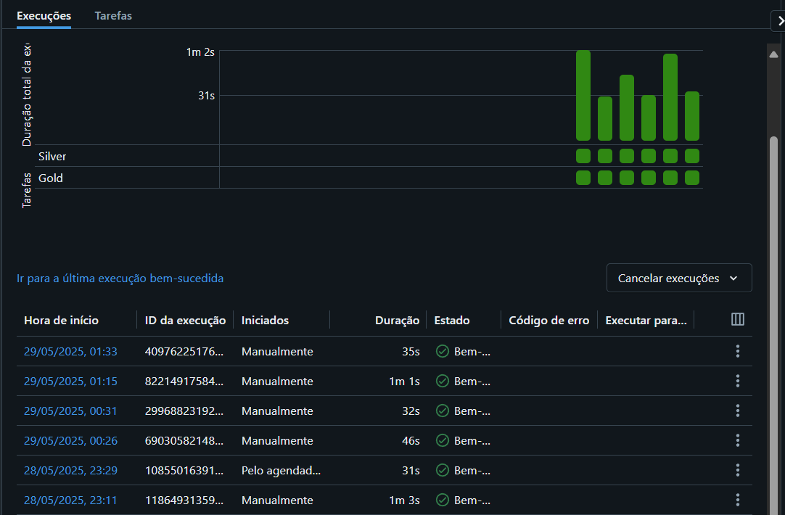

# 📄 Documentação do Projeto — Pipeline Azure + Databricks

## 🏢 Sobre os Dados

Os dados utilizados neste projeto são provenientes de **uma empresa do setor aeronáutico**, contendo informações detalhadas sobre ocorrências envolvendo aeronaves. Eles incluem campos como o número de lesões fatais, graves, leves, número total de pessoas a bordo, local, estado, e outros indicadores relevantes para análise de segurança e operações.

O objetivo é transformar e preparar esses dados para análises avançadas, garantindo qualidade e confiabilidade nas camadas finais do Data Lake.

---

## 🏗 Recursos Criados

✅ Grupo de Armazenamento (Resource Group) — criado no Azure  
✅ Conta de Armazenamento (Storage Account) — criada para armazenar dados em diferentes camadas (Bronze, Silver, Gold)  
✅ Container — configurado dentro da Storage Account  
✅ Pastas — organizadas dentro do container (para cada camada do Data Lake)  
✅ Registro — criado para gerenciar acessos  

---

## 📌 Visão Geral do Projeto

Este projeto teve como objetivo **realizar transformações de dados brutos usando recursos do Azure e Databricks**, seguindo o conceito de Data Lakehouse com as camadas:  

- **Bronze** → Dados brutos, diretamente extraídos da fonte  
- **Silver** → Dados tratados (ex.: limpeza de nulos, conversão de tipos, ajustes básicos)  
- **Gold** → Dados prontos para análise final e consumo, com agregações e colunas adicionais

---

## ⚙ Tecnologias e Ferramentas Utilizadas

- Azure Storage Account  
- Azure Databricks  
- Apache Spark (PySpark)  
- GitHub  
- Azure Data Factory (ADF)  
- Databricks Workflows  

---

## 📂 Estrutura das Camadas

| Camada   | Descrição                                                                 |
|----------|---------------------------------------------------------------------------|
| Bronze   | Armazenamento inicial dos dados brutos, sem nenhum tratamento             |
| Silver   | Dados parcialmente transformados, com limpeza de colunas e tipos ajustados |
| Gold     | Dados prontos para consumo analítico, com cálculos agregados e particionados por Estado |

---

## 🔄 Fluxo de Processamento

1️⃣ Dados brutos armazenados na camada Bronze →  
2️⃣ Leitura no Databricks Notebook →  
3️⃣ Transformações aplicadas, incluindo:  
- Seleção de colunas relevantes  
- Criação da coluna `Total_Lesoes` somando lesões fatais, graves, leves e ilesos  
- Substituição de valores nulos em colunas de texto para `'Sem Registro'`  
- Conversão de colunas string para inteiro onde necessário  
- Renomeação de colunas para nomes mais intuitivos  
- Filtragem de estados indesejados (`Indeterminado`, `Sem Registro`, `Exterior`)  
- Inclusão de coluna com timestamp de atualização  
4️⃣ Escrita final na camada Gold, atualmente em formato **Parquet** 

---

## 💡 Aprendizados e Considerações

✅ Criação e configuração de pipelines no **Azure Data Factory**  
✅ Orquestração de notebooks com **Databricks Workflows**  
✅ Integração do Databricks ao **GitHub** para versionamento  
✅ Configuração de permissões entre Databricks e Azure  
✅ Entendimento de que, mesmo excluindo arquivos no Azure, a reexecução do pipeline consegue repovoar os dados automaticamente

#Evidências: 

